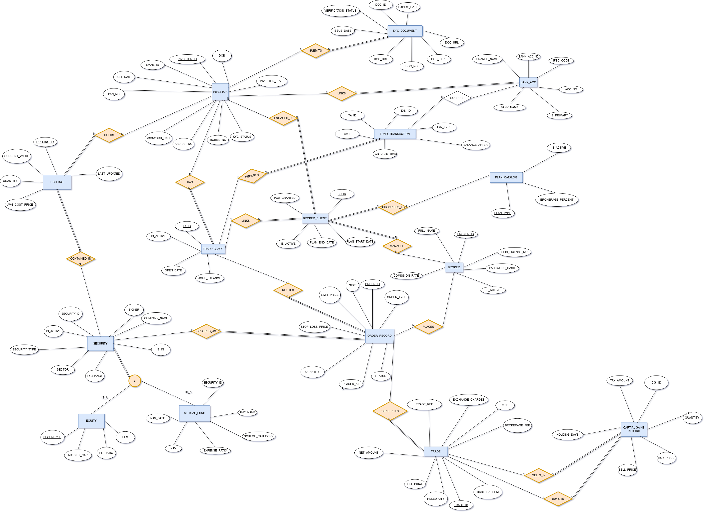
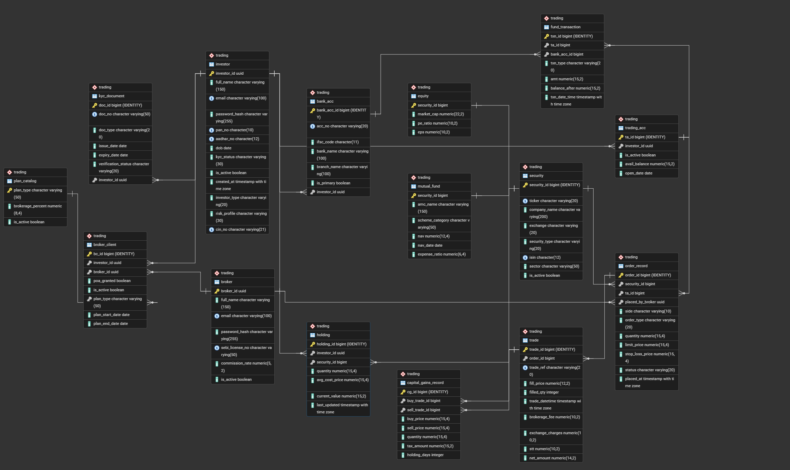

# StockVault - Stock & Portfolio Management System

StockVault is a database-driven stock and portfolio management system developed as a DBMS course project. The objective of this project is to model the core functionality of a real-world stock trading platform using a well-designed relational database.

The system allows investors to maintain trading accounts, complete KYC verification, manage bank accounts, buy and sell securities through brokers, track holdings, record fund transactions, and calculate capital gains. The database is designed with normalization, referential integrity, and scalability in mind.

---

## Project Objectives

The primary goal of this project was to design a realistic financial database while applying fundamental database concepts such as:

- Entity Relationship (ER) Modeling
- Relational Schema Design
- Database Normalization (up to 3NF)
- Primary and Foreign Key Constraints
- SQL DDL and DML
- Referential Integrity
- Real-world Business Rules

---

## Features

The database supports the following functionalities:

- Investor registration and profile management
- KYC document verification
- Multiple bank accounts for investors
- Trading account creation
- Broker and client management
- Brokerage plan subscription
- Equity and Mutual Fund management
- Buy and Sell order recording
- Trade execution history
- Fund deposit and withdrawal tracking
- Portfolio holding management
- Capital gains calculation

---

## Database Design

The project was designed following the standard database development process:

```
Requirement Analysis
        ↓
Entity Relationship Diagram
        ↓
Relational Schema
        ↓
Normalization
        ↓
PostgreSQL Implementation
```

The schema consists of **15 interconnected tables** representing different components of a stock trading ecosystem.

---

## Database Tables

| Table | Purpose |
|--------|---------|
| Investor | Stores investor information |
| KYC_Document | Maintains KYC details |
| Bank_Acc | Investor bank accounts |
| Trading_Acc | Trading account information |
| Broker | Broker details |
| Broker_Client | Broker-investor relationship |
| Plan_Catalog | Brokerage plans |
| Security | Base information for securities |
| Equity | Equity-specific attributes |
| Mutual_Fund | Mutual fund-specific attributes |
| Holding | Current portfolio holdings |
| Order_Record | Buy/Sell orders |
| Trade | Executed trades |
| Fund_Transaction | Money transfers |
| Capital_Gains_Record | Capital gain calculations |

---

## Entity Relationships

Some important relationships in the database include:

- An investor can own multiple bank accounts.
- Each investor has a trading account.
- Investors submit KYC documents for verification.
- Investors can subscribe to brokerage plans through brokers.
- Trading accounts place buy and sell orders.
- Orders generate executed trades.
- Trades update portfolio holdings.
- Securities are categorized as either Equity or Mutual Funds.
- Completed trades are used to calculate capital gains.

---

## ER Diagram

<p align="center">
  
</p>

---

## Relational Schema

<p align="center">
  
</p>

---

## Technologies Used

- PostgreSQL
- SQL
- ER Diagram
- Relational Schema Design

---

## Project Structure

```
StockVault/
│
├── final_ddl.sql
├── Queries.sql
├── ER_Diagram.png
├── Relational_Schema.png
└── README.md
```

---

## Design Highlights

Some important design decisions made during development include:

- UUIDs used for investor identification.
- Identity columns used where appropriate for auto-generated IDs.
- Proper use of Primary Keys and Foreign Keys.
- Database normalized to reduce redundancy.
- Supertype/Subtype relationship implemented for `Security`, `Equity`, and `Mutual_Fund`.
- Business rules enforced using SQL constraints.
- Separate tables for orders, trades, holdings, and capital gains to maintain transaction history.

---

## Future Improvements

Although this project focuses on database design, it can be extended into a complete stock trading application by adding:

- Stored Procedures
- Triggers
- Views
- Index optimization
- User authentication
- REST APIs
- Portfolio analytics dashboard
- Role-based access control
- Audit logs
- Performance reporting

---

## What I Learned

Working on StockVault helped me gain practical experience in:

- Designing a relational database from scratch
- Converting an ER model into a normalized schema
- Implementing constraints and relationships in PostgreSQL
- Modeling a real-world financial system
- Writing SQL queries for data management and retrieval

---

## Author

**Prince Gadara**
